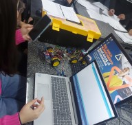

# Galeria de Atividades e Eventos

Esta seção apresenta um registro visual da evolução do projeto do robô seguidor de linha, abrangendo as etapas de desenvolvimento e a participação em competições.

## Competição de 27 de Maio de 2025

[[Clique aqui para acessar o resultado final das competições 2025.1]](result20251.md)

## Desenvolvimento em 15 de Abril de 2025

## Competição de 29 de Abril de 2019

[[Artigo com entrevista do grupo de alunos]](https://web.archive.org/web/20201204174705/https://www.ibirapuera.br/entrevista-com-alunos-de-ciencia-da-computacao-sobre-a-construcao-de-robos/). Este artigo detalha as etapas do projeto, o papel dos integrantes, o processo de criação e desenvolvimento técnico do robô (envolvendo as equipes UNIBTRON e PREDADOR), bem como a divulgação do trabalho por meio de um site e a produção de um artigo científico.

 Last edited: 2025-07-23 15:01:55
