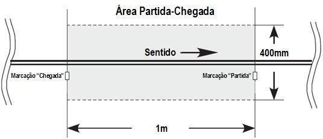

# Regras para o Robô Autônomo Seguidor de Linha

Esta regra é baseada nas diretrizes disponíveis em: <https://www.ifsp.edu.br/trif>

## 1. Introdução

- **Nome da Modalidade:** seguidor de linha
- **Número de Robôs por Partida:** um por equipe
- **Duração da Tomada de Tempo:** verificar item 5: "A Tomada de Tempo"
- **Dimensões aproximadas dos Robôs:** 250 x 250 x 200 mm
- **Especificações do Circuito:** verificar item 4: "O Percurso"
- **Especificações de Controle:** autônomo

## 2. A Competição

2.1. Seguidor de linha é uma modalidade em que robôs autônomos correm em um percurso especificado por uma linha contínua para determinar qual é o mais rápido.

2.2. Vencerá o robô que realizar a volta válida mais rápida dentre todas as tomadas de tempo.

2.3. Será realizado um briefing antes do início da competição para esclarecer e elucidar quaisquer dúvidas dos competidores. É de responsabilidade das equipes interessadas estar presente no briefing com pelo menos um representante no horário combinado.

2.4. A organização poderá realizar um briefing adicional para discutir qualquer eventualidade, como algo não previsto nestas regras.

2.5. Em caso de qualquer incidente que não esteja previsto nessas regras ou não tenha sido acordado previamente no briefing, fica a critério da organização do evento como proceder.

2.6. Os juízes poderão solicitar informações sobre o robô se julgarem necessário. Os juízes têm o poder de desclassificar um robô e de tomar qualquer decisão que achem pertinente durante a competição, desde que devidamente justificada sob o parecer das regras e do briefing.

## 3. Especificações dos Robôs

3.1. Os robôs devem ser totalmente autônomos e com todos os componentes embarcados. Eles não podem ser controlados externamente, com exceção para serem iniciados ou para ajustes de parâmetros.

3.1.1. Os parâmetros do robô, tais como velocidade, aceleração ou qualquer outro, podem ser alterados, seja por meio de chaves, botões ou de maneira remota, desde que o software já existente assim permita e que isso seja feito apenas entre duas tentativas.

3.2. As dimensões máximas são aproximadamente 250 mm de comprimento, 250 mm de largura e 200 mm de altura, não podendo alterar suas dimensões durante a tomada de tempo.

3.3. O robô pode usar métodos de empuxo e/ou sucção que aumentem a força normal em relação ao solo. Métodos permitidos se estendem mas não se limitam a turbinas, hélices e ventoinhas. O mecanismo deve ser montado sobre o chassi do robô, podendo ficar sobre os demais componentes, sobre as rodas, ou até mesmo nas laterais do robô, desde que não ultrapasse as dimensões máximas permitidas.

3.3.1. Se o sistema de aumento de força normal do robô causar um dano à pista durante testes ou tomadas de tempo, o robô poderá ser desclassificado pelo juiz.

3.4. É proibido adicionar qualquer produto aos pneus de modo a alterar o poder de tração do robô em relação ao solo.

3.5. É de responsabilidade do competidor provar que o seu robô é único e o mesmo utilizado em toda a competição para cada inscrição. Em caso de robôs iguais ou muito parecidos, o competidor ou a equipe precisa adotar elementos mecânicos não intercambiáveis que possam identificar a singularidade de cada robô, como, por exemplo, uma característica mecânica (cor ou formato do chassi, entre outros). Se o juiz julgar que as diferenças não são suficientes, apenas um dos robôs será autorizado a competir e os demais serão desclassificados.

3.6. Todos os robôs devem ser aprovados por uma inspeção antes de cada tomada de tempo.

## 4. O Percurso

4.1. O percurso é o trajeto definido por uma linha branca que se estende a partir de uma marcação de partida até uma marcação de chegada.

4.2. A superfície da pista é composta por uma ou mais mantas emborrachadas de cor preta colocadas sobre uma superfície plana, podendo conter emendas. Possíveis desníveis poderão ocorrer e serão minimizados da melhor forma possível com fita preta nas emendas. De qualquer forma, os robôs deverão ser capazes de superar tais desníveis (± 3 mm).

4.3. Não serão aceitas reclamações sobre a aderência da pista, desde que seja respeitado o item 4.2.

4.4. O percurso é indicado por uma linha branca de 19 ± 1 mm de largura. O comprimento total da linha deve ser de no máximo 60 m.

4.5. A linha consiste em combinações de retas e arcos. A linha pode cruzar sobre si.

4.6. Quando houver um cruzamento, o ângulo de intersecção das linhas será de 90 ± 5° (vide figura 1). As partes das linhas 250 mm antes e 250 mm depois do cruzamento serão retas.

  
*Figura 1: ângulo do cruzamento e espessura da linha.*

4.7. A linha de partida e a linha de chegada estão localizadas em uma reta do percurso. A linha de chegada está localizada a um metro para trás da linha de partida. Há marcações no lado direito da linha (em relação ao sentido do percurso) indicando os pontos de partida e de chegada (vide figuras 2 e 3).

  
*Figura 2: marcações de partida e de chegada de acordo com o sentido do percurso.*

4.8. A área da pista a qual se estende entre o ponto de partida e o ponto de chegada, considerando 200 mm à direita da linha e 200 mm à esquerda da linha, é denominada "área de partida-chegada" (vide figura 3).

  
*Figura 3: área de partida-chegada.*

4.9. Um portão de partida e um de chegada podem ser colocados nas linhas de partida e de chegada, respectivamente. Estes portões devem ter pelo menos 400 mm de largura e 200 mm de altura no interior.

4.10. A linha que define o percurso deve manter uma distância de pelo menos 200 mm dos portões de partida e de chegada em toda a extensão do trajeto.

4.11. A linha que define o percurso deve manter uma distância de pelo menos 200 mm das bordas da pista em toda a extensão do trajeto.

4.12. As distâncias entre os diferentes trechos que compõem o percurso devem ser de pelo menos 200 mm.

4.13. A linha 250 mm antes e 250 mm depois da área partida-chegada” é reta.

4.14. O raio dos arcos é de no mínimo 100 mm (vide figura 4).

4.15. Haverá uma marcação no lado esquerdo da linha (em relação ao sentido do percurso) no ponto em que houver alteração da curvatura (vide figura 4).

4.16. Um percurso pode ter arcos com diferentes curvaturas ligadas continuamente, sempre observando os itens 4.13 e 4.14 (vide figura 4).

  
*Figura 4: raios e marcações de mudança de curvatura.*

4.17. Erros de no máximo ± 3 mm no comprimento e na distância das marcações de curvas e largada e chegada para a pista serão considerados aceitáveis.

4.18. O circuito é montado na horizontal, porém partes dele podem ser inclinadas em até 5°.

4.19. As tonalidades da linha e da pista estão sujeitas a possíveis variações, dependendo do fornecedor dos materiais utilizados na confecção das mesmas, porém existe um grande contraste entre o branco da faixa e o preto da pista.

4.20. Qualquer contestação sobre a conformidade da pista deve ser imediatamente notificada à organização, desde que a competição não tenha sido iniciada. Ficará a critério da própria organização sobre como proceder.

## 5. A Tomada de Tempo

5.1. As tomadas de tempo serão realizadas durante um período estipulado pela organização e informadas com antecedência. Os competidores farão suas tomadas por ordem de chegada e de forma organizada.

5.2. A área delimitada e sinalizada ao redor da pista oficial é chamada de "área de tomada de tempo".

5.3. Cada tomada de tempo terá uma duração máxima de 5 minutos e será iniciada no instante em que o robô adentrar na "área de tomada de tempo".

5.4. São permitidos apenas dois integrantes da equipe que está tomando tempo na "área de tomada de tempo".

5.4.1. Um terceiro membro será permitido na “área de tomada de tempo" para a filmagem do robô, porém ele deverá manter uma distância segura ao redor de toda a área da pista.

5.5. O robô deverá iniciar parado sobre a linha que define o trajeto e dentro da zona de partida-chegada para, em seguida, percorrer o circuito na direção correta.

5.6. O robô deverá percorrer o circuito tomando como referência a linha branca. O corpo do robô deverá ficar sobre a linha durante todo o percurso. Caso o robô saia completamente de cima da linha branca, será considerado que o robô saiu do percurso e a volta será invalidada.

5.6.1. Em caso de contestações sobre a saída ou não de um robô da pista, vindas por parte do competidor ou de outros competidores, o juiz irá avaliar todas as provas em vídeo feitas pelas equipes ao redor que estiverem acompanhando e filmando a tentativa. A decisão do juiz poderá ser alterada se o robô ainda estiver dentro da “área de tomada de tempo".

5.6.2. Caso as imagens disponíveis sejam inconclusivas para o juiz, será mantida a decisão.

## 6. Penalidades

6.1. Constitui motivo de desclassificação e expulsão do evento:

6.1.1. Insultar ou atacar membros da organização, bem como outros competidores.

6.1.2. Causar intencionalmente danos à área de competição.

6.1.3. Causar intencionalmente danos às instalações.

6.1.4. Causar intencionalmente danos ao robô oponente.

6.2. Constitui motivo de desclassificação:

6.2.1. Manipular ou controlar um robô externamente por qualquer meio uma vez que tomada de tempo tenha começado.

6.2.2. Usar dispositivos que podem causar danos à pista ou que impeçam a continuidade da disputa.

6.2.3. Causar danos à área de competição.

6.2.4. Usar dispositivos que possam causar danos físicos às pessoas.

6.2.5. Exibir condutas antidesportivas.

6.3. Constitui motivo de advertência:

6.3.1. Atraso no comparecimento para tomada de tempo.

6.3.2. Movimentação do robô antes da solicitação pelo juiz.

6.3.3. Reivindicações por integrantes que não sejam o responsável pela categoria.

6.3.4. Acesso indevido de integrantes que não sejam operador e/ou assistente na pista.

6.3.5. "Guardar lugar" na fila de testes da categoria sem robôs em mãos.

6.4. Os juízes têm autonomia para advertir, desclassificar ou expulsar os participantes nos casos que não tenham sido cumpridas as orientações desse documento.

 Last edited: 2025-07-22 21:24:48
