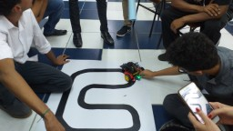

## 2019-04-29 competição

[[Artigo com entrevista do grupo de alunos]](https://web.archive.org/web/20201204174705/https://www.ibirapuera.br/entrevista-com-alunos-de-ciencia-da-computacao-sobre-a-construcao-de-robos/). Este artigo detalha as etapas do projeto, o papel dos integrantes, o processo de criação e desenvolvimento técnico do robô (envolvendo as equipes UNIBTRON e PREDADOR), bem como a divulgação do trabalho por meio de um site e a produção de um artigo científico.

 Last edited: 2026-02-04 19:29:20
